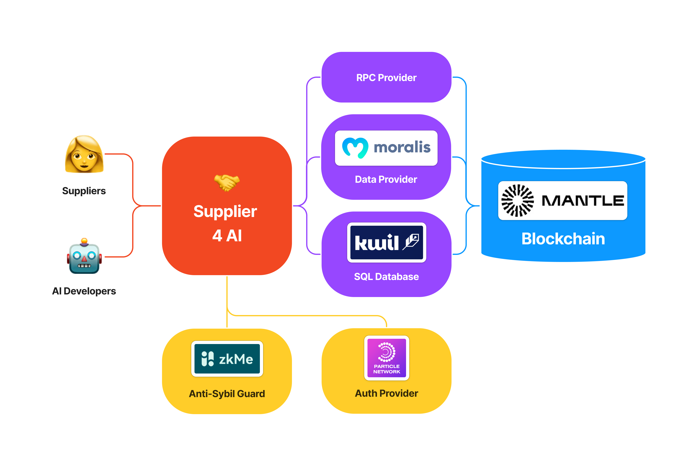

# 🤝 Dataset Supplier

Earn from your own data by supplying it to AI for learning.

## 🔗 Application

https://dataset-supplier-app.vercel.app/

## ✨ About

Today, developers use huge amounts of public data to train AI. But the authors of this data are not compensated for using it.

To solve this problem, I built a web3 application where you can earn from your own data by supplying it to AI for learning.

## ⚒️ How it's made

To make it, I used:

- K.Transformer to retrieve data with user tokens for supply.
- The Graph to get data to create custom user dashboards.
- Kwil for storing data in a form suitable for AI training.
- Particle Network for more convenient and faster login of users.

## 🚀 Plans

There are many ideas on how to improve this project. It would be great to:

- Integrate web2 services for artists, such as Artstation.
- Improve the UI to support large amounts of tokens.
- Connect Reddit and other social networks to provide text data so that authors can earn, too.
- And collaborate with big AI companies.

## 🏗️ Architecture

